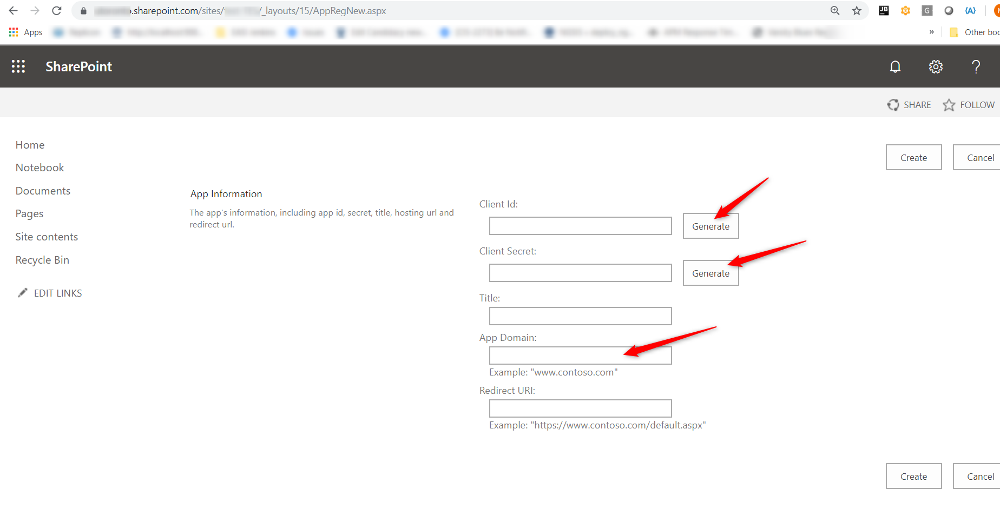
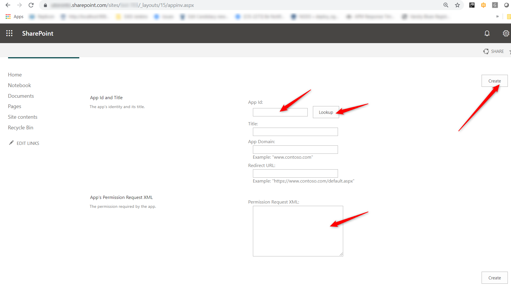

# Accessing Sharepoint Online with a Server to Server credential

These steps document the process taken to setup a server-to-server credential that can be used
from a non-sharepoint application to manipulate files and content within sharepoint.


The setup is based on the notes from here:

https://github.com/ssswang/sharepoint-oauth-app-client/blob/master/docs/Credentials.md

In that case it is a PHP library but here I provide a simple Spring RestTemplate based approach.

# Registering an App

## Sharepoint Domain

mycompany.sharepoint.com

## Sharepoint Site

| Site Name | Full Site |
| -------- | -------- |
| my-site  | mycompany.sharepoint.com/sites/my-site |

## App Registration Form

The app registration form in sharepoint is per-site, normally:
https://mycompany.sharepoint.com/sites/my-site/_layouts/15/AppRegNew.aspx.



* Click on Client Id - Generate
** write down - used in client_id below
* Click on Client Secret - Generate
** write down - used in client secret below
* Enter a value for the Title field.
* Enter **localhost** for App Domain (used in client_id below)
* Redirect URI is not needed but a value is.  Enter **https://localhost**
* Click on the **CREATE** button to create the registration.

From here we can get the <<client id>>, the <<client secret>> and the <<app domain>>.


## App Permission Request XML

After the application has been authorized you need to setup its permissions.  Without permissions
a sharepoint user is needed and then the app gets delegated authorization from that user.

In the server to server context we need to setup the permissions in advance and then when the 
authorization request is made those permissions can be used without needing to prompt any user.

https://<<sharepoint domain>>/sites/<<sharepoint site>>/_layouts/15/appinv.aspx

e.g. https://mycompany.sharepoint.com/sites/my-site/_layouts/15/appinv.aspx

### Permission Documentation
http://sharepoint/content/sitecollection/web

### Example Permission XML

```xml  
<AppPermissionRequests AllowAppOnlyPolicy="true">
<AppPermissionRequest Scope="http://sharepoint/content/sitecollection/web" Right="Write" />
</AppPermissionRequests>
```



* Enter **client_id** 
* Click on **Lookup**
* Copy paste the Permission XML into the indicated text area.
* Click on **Create** to setup the application permissions.

# OData Webservice Data

In order to access the Sharepoint online Webservices we need to get an oauth JWT token which is then
passed as an *Authorization: Bearer << JWT >>* on API requests.

The client_id, client_secret and resource used to retrieve the JWT token can be determined below.

Once determined follow the [Setup](Setup.md) Instructions.

```http request
GET https://mycompany.sharepoint.com/_vti_bin/client.svc
Authorization: Bearer
```

Will fail with a 401 Not Authorized error.

But amongst the output will be the WWW-Authenticate response header which contains key fields:

```
WWW-Authenticate: Bearer realm="11111111-2222-2222-3333-333333333333",client_id="11111111-1111-1111-1111-12345678900",trusted_issuers="00000000-0000-0000-0000-000000000000@*,11111111-1111-1111-1111-111111111111@*,https://sts.windows.net/*/,0000000-0000-0000-0000-000000000000@11111111-1111-1111-1111-111111111111",authorization_uri="https://login.windows.net/common/oauth2/authorize"
```

Extract << bearer realm >> and << client_id >> which we will call the << header client id >>

# Resource

The resource is a hybrid which is composed of:
* header client id
* sharepoint domain
* bearer realm

```
<<header client id>>/<<sharepoint domain>>@<<bearer realm>>

11111111-1111-1111-1111-12345678900/mycompany.sharepoint.com@11111111-2222-2222-3333-333333333333 
```

# client_id

The client_id is a hybrid which is composed of:
* client id from the app registration.
* application domain from the app registration.
* bearer realm
```
<<client id from app registration>>/<<app domain>>@<<bearer realm>>
AAAAAAAA-AAAA-AAAA-AAAA-AAAAAAAAAAAA/localhost@11111111-2222-2222-3333-333333333333
```

# client_secret

The client secret is exactly what was generated or set during app registration.
```
<< client secret from app registration >>
QSBjbGllbnQgc2VjcmV0IHdvdWxkIGJlIGhlcmUgaW4gcmVhbCBsaWZl
```


