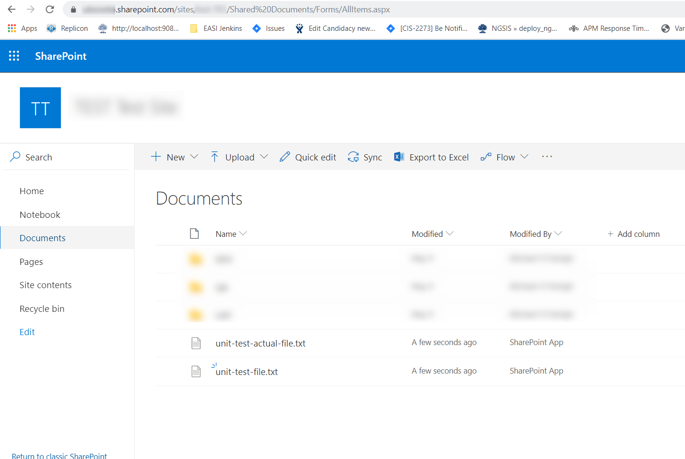

# Application Setup

First follow the directions to acquire the necessary [credentials](Credentials.md).

Then continue below to configure and run the TestSharepointImpl test case using them.


# io.github.sharepoint_oauth.SharepointAPI

The **io.github.sharepoint_oauth.SharepointImpl** class acquires a token which can be used to make
requests to sharepoint.

The SharepointAPI exposes some methods for file operations based on the REST API methods described here:
https://docs.microsoft.com/en-us/sharepoint/dev/sp-add-ins/working-with-folders-and-files-with-rest

You could adjust the api to support other methods and file a pull request.
 
 # Run TestSharepointImpl Test Case
 
 Change line 43 in TestSharepointImpl to setup the url to your sharepoint site (must be the same site
 used when setting up the [credentials](Credentials.md)):
 
 ```java
sharepoint.setSharepointBaseUrl("https://mycompany.sharepoint.com/sites/my-site/_api/web");
```
 Setup system properties to pass through the actual sharepoint credentials:
``` 
 -Dclient_id=AAAAAAAA-AAAA-AAAA-AAAA-AAAAAAAAAAAA/localhost@11111111-2222-2222-3333-333333333333
 -Dclient_secret=QSBjbGllbnQgc2VjcmV0IHdvdWxkIGJlIGhlcmUgaW4gcmVhbCBsaWZl
 -Dresource=11111111-1111-1111-1111-12345678900/mycompany.sharepoint.com@11111111-2222-2222-3333-333333333333
 ```
 
 After running the test case then you can expect two files to have been placed into the root of the 
 Shared Documents of your Sharepoint Site:
 

